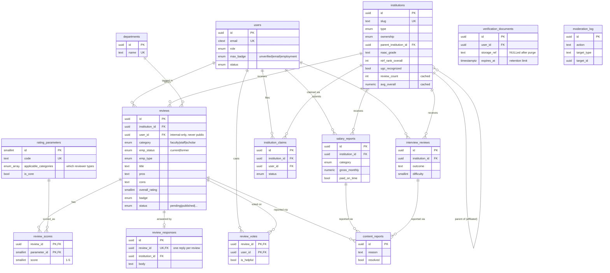

# CampusSamiksha — Entity-Relationship Diagram

Renders anywhere Mermaid is supported (GitHub, VS Code with a Mermaid extension,
Obsidian, etc.). Mirrors [`prisma/schema.prisma`](../prisma/schema.prisma) and
[`db/schema.sql`](../db/schema.sql).

## Reading the model

- **One review, many parameter scores.** `reviews` holds the prose + overall
  star; `review_scores` holds the per-parameter 1–5 stars. `rating_parameters`
  declares *which reviewer categories* each parameter applies to via
  `applicable_categories`, so the same tables serve faculty, staff and scholars
  without per-type columns.
- **Anonymity boundary.** `reviews.user_id` exists only for anti-spam and
  moderation. It must never cross into any public/institution-facing response.
- **Verification without retention.** `verification_documents` is transient —
  a purge job clears `storage_ref` after `expires_at`; the durable outcome is
  the `badge` on `users`/`reviews`.
- **Fairness + legal.** `review_responses` gives each institution one official
  reply per review; `content_reports` + `moderation_log` back the IT-Rules
  notice-and-takedown workflow.
- **Cold-start.** The factual columns on `institutions` (NAAC/NIRF/UGC/AICTE)
  make profiles useful and SEO-indexable before any review exists.
